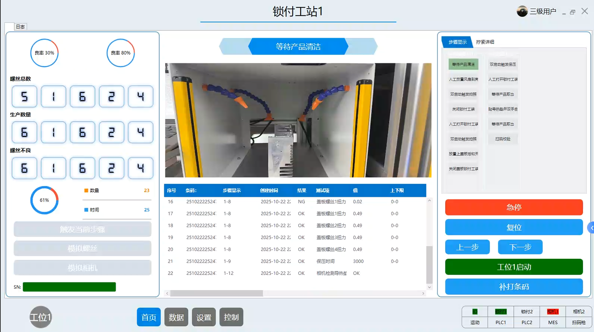
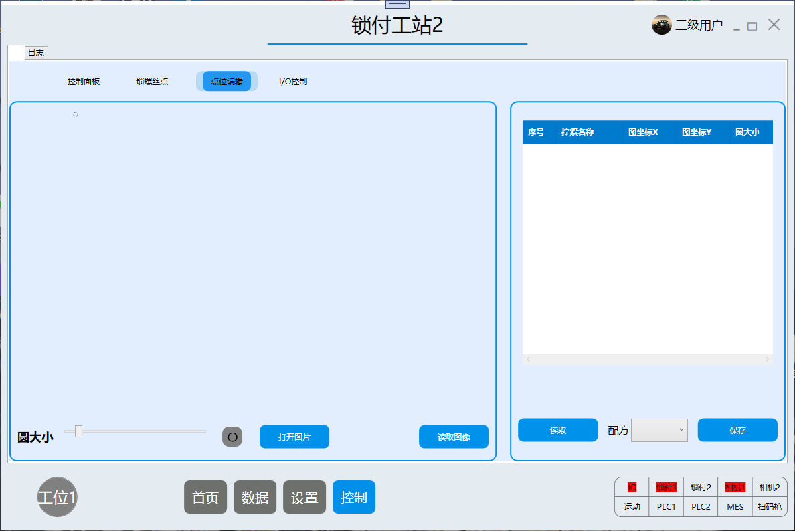

# ScrewFullStation

# 比较完善的拧紧工站

# 锁付系统软件说明书
# 目录  
### 一、系统概述  
&nbsp;&nbsp;&nbsp;&nbsp;（一）系统功能简介  
### 二、系统登录  
&nbsp;&nbsp;&nbsp;&nbsp;（一）登录界面说明  

&nbsp;&nbsp;&nbsp;&nbsp;（二）登录操作步骤  
### 三、系统功能模块  
&nbsp;&nbsp;&nbsp;&nbsp;（一）首页模块  
&nbsp;&nbsp;&nbsp;&nbsp;&nbsp;&nbsp;&nbsp;&nbsp;&nbsp;&nbsp;&nbsp;&nbsp;1．功能按钮  
&nbsp;&nbsp;&nbsp;&nbsp;&nbsp;&nbsp;&nbsp;&nbsp;&nbsp;&nbsp;&nbsp;&nbsp;2．生产数据展示  
&nbsp;&nbsp;&nbsp;&nbsp;&nbsp;&nbsp;&nbsp;&nbsp;&nbsp;&nbsp;&nbsp;&nbsp;3．步骤显示  
&nbsp;&nbsp;&nbsp;&nbsp;&nbsp;&nbsp;&nbsp;&nbsp;&nbsp;&nbsp;&nbsp;&nbsp;4．步骤显示/拧紧详细  
&nbsp;&nbsp;&nbsp;&nbsp;&nbsp;&nbsp;&nbsp;&nbsp;&nbsp;&nbsp;&nbsp;&nbsp;5．日志  

&nbsp;&nbsp;&nbsp;&nbsp;（二）数据模块  

&nbsp;&nbsp;&nbsp;&nbsp;（三）设置模块  
&nbsp;&nbsp;&nbsp;&nbsp;&nbsp;&nbsp;&nbsp;&nbsp;&nbsp;&nbsp;&nbsp;&nbsp;1.用户管理  

&nbsp;&nbsp;&nbsp;&nbsp;（四）控制模块  
&nbsp;&nbsp;&nbsp;&nbsp;&nbsp;&nbsp;&nbsp;&nbsp;&nbsp;&nbsp;&nbsp;&nbsp;1.控制面板  
&nbsp;&nbsp;&nbsp;&nbsp;&nbsp;&nbsp;&nbsp;&nbsp;&nbsp;&nbsp;&nbsp;&nbsp;2.锁螺丝点  
&nbsp;&nbsp;&nbsp;&nbsp;&nbsp;&nbsp;&nbsp;&nbsp;&nbsp;&nbsp;&nbsp;&nbsp;3.点位编辑  
&nbsp;&nbsp;&nbsp;&nbsp;&nbsp;&nbsp;&nbsp;&nbsp;&nbsp;&nbsp;&nbsp;&nbsp;4.I/O控制  
 

## 一．系统概述  

系统功能简介：  
&nbsp;&nbsp;&nbsp;&nbsp;&nbsp;&nbsp;&nbsp;&nbsp;锁付系统软件是一款专用于自动化螺丝锁付作业的专业控制软件，广泛应用于电子、汽车等行业的精密螺丝锁付场景。该系统集成了系统登录、控制面板操作、点位编辑、I/O 控制、物理坐标管理、用户管理以及数据展示等功能，能够对锁付过程实现精准控制和全面监控。同时，软件支持多工位协同作业、参数化配置与生产数据实时监控，有助于显著提升锁付作业的精度与效率，满足现代制造业对自动化锁付的高要求。  

## 二．系统登录  

  
（一）登录界面说明  
&nbsp;&nbsp;&nbsp;&nbsp;&nbsp;&nbsp;&nbsp;&nbsp;系统登录界面包含用户登录、密码输入、显示密码切换、强制登录选项及语言选择功能。  

（二）登录操作步骤  
&nbsp;&nbsp;&nbsp;&nbsp;&nbsp;&nbsp;&nbsp;&nbsp;1.在“用户”输入框填写用户名，“密码”输入框填写对应密码。  
&nbsp;&nbsp;&nbsp;&nbsp;&nbsp;&nbsp;&nbsp;&nbsp;2.若需明文查看密码，勾选“显示密码”；若需强制登录（如管理员紧急操作），勾选“强制登录”（强制登录默认用户为`admin`，密码为`lx123456`）。  
&nbsp;&nbsp;&nbsp;&nbsp;&nbsp;&nbsp;&nbsp;&nbsp;3.点击“登录”按钮完成登录；点击“退出”按钮关闭系统。  
&nbsp;&nbsp;&nbsp;&nbsp;&nbsp;&nbsp;&nbsp;&nbsp;4.可通过下方下拉框选择界面语言，如“简体中文”。  

## 三．系统功能模块  

#### （一）首页模块  
  
  
  
&nbsp;&nbsp;&nbsp;&nbsp;&nbsp;&nbsp;&nbsp;&nbsp;1．功能按钮  
&nbsp;&nbsp;&nbsp;&nbsp;&nbsp;&nbsp;&nbsp;&nbsp;急停：红色按钮，用于在紧急情况下立即停止锁付工站的所有运行操作，保障设备和人员安全。  
&nbsp;&nbsp;&nbsp;&nbsp;&nbsp;&nbsp;&nbsp;&nbsp;暂停：黄色按钮，用于暂时停止当前的锁付工作流程，可在需要时恢复继续运行。  
&nbsp;&nbsp;&nbsp;&nbsp;&nbsp;&nbsp;&nbsp;&nbsp;工位1启动：绿色按钮，点击后启动工位 1 的锁付工作流程，使工位 1 开始执行锁付任务。  
&nbsp;&nbsp;&nbsp;&nbsp;&nbsp;&nbsp;&nbsp;&nbsp;补打条码：蓝色按钮，用于在需要时补充打印相关条码，可能与产品的条码标识管理有关。  
&nbsp;&nbsp;&nbsp;&nbsp;&nbsp;&nbsp;&nbsp;&nbsp;首页：界面底部左侧蓝色按钮，点击后回到系统的首页界面，展示整体数据和操作入口。  
&nbsp;&nbsp;&nbsp;&nbsp;&nbsp;&nbsp;&nbsp;&nbsp;数据：界面底部按钮，点击后可进入数据相关页面。  
&nbsp;&nbsp;&nbsp;&nbsp;&nbsp;&nbsp;&nbsp;&nbsp;设置：界面底部按钮，点击后进入设置页面。  
&nbsp;&nbsp;&nbsp;&nbsp;&nbsp;&nbsp;&nbsp;&nbsp;控制：界面底部按钮，点击后进入控制页面。  
&nbsp;&nbsp;&nbsp;&nbsp;&nbsp;&nbsp;&nbsp;&nbsp;触发当前步骤：点击该按钮，可触发当前生产流程中的步骤，用于手动控制生产步骤的执行，方便在调试或特定生产需求下推进生产流程。  
&nbsp;&nbsp;&nbsp;&nbsp;&nbsp;&nbsp;&nbsp;&nbsp;模拟螺丝：用于模拟螺丝相关的生产操作，可在不实际使用螺丝的情况下，对螺丝锁付等相关流程进行模拟测试，便于系统调试和操作练习。  
&nbsp;&nbsp;&nbsp;&nbsp;&nbsp;&nbsp;&nbsp;&nbsp;模拟相机：模拟相机的功能，可在没有实际相机参与的情况下，对与相机相关的图像采集、识别等流程进行模拟，用于系统功能测试和调试。  

&nbsp;&nbsp;&nbsp;&nbsp;&nbsp;&nbsp;&nbsp;&nbsp;2．生产数据展示  
&nbsp;&nbsp;&nbsp;&nbsp;&nbsp;&nbsp;&nbsp;&nbsp;螺丝总数：显示当前生产任务中涉及的螺丝总数量，为用户提供螺丝总量的信息参考  
&nbsp;&nbsp;&nbsp;&nbsp;&nbsp;&nbsp;&nbsp;&nbsp;生产数量：展示已经完成生产的产品数量，反映生产进度情况  
&nbsp;&nbsp;&nbsp;&nbsp;&nbsp;&nbsp;&nbsp;&nbsp;螺丝不良：显示生产过程中出现不良情况的螺丝数量，辅助用户了解产品不良率相关信息，以便及时排查问题  

&nbsp;&nbsp;&nbsp;&nbsp;&nbsp;&nbsp;&nbsp;&nbsp;3．步骤显示  
&nbsp;&nbsp;&nbsp;&nbsp;&nbsp;&nbsp;&nbsp;&nbsp;显示当前步骤：信息展示类的标题或区域标识，用于提示用户当前界面呈现的是锁付工站 2 在运行过程中的步骤相关信息。  
&nbsp;&nbsp;&nbsp;&nbsp;&nbsp;&nbsp;&nbsp;&nbsp;序号：表格列之一，用于对每一条步骤记录进行编号，方便用户对记录进行有序查看和管理，快速定位特定的步骤记录。  
&nbsp;&nbsp;&nbsp;&nbsp;&nbsp;&nbsp;&nbsp;&nbsp;条码：表格列之一，用于显示与锁付步骤相关的产品条码信息，通过条码可追溯对应产品的相关生产数据和信息，便于产品的管理与质量追溯。  
&nbsp;&nbsp;&nbsp;&nbsp;&nbsp;&nbsp;&nbsp;&nbsp;步骤显示：表格列之一，展示锁付工站 2 当前或历史的步骤内容，让用户清楚了解每一步的操作或运行情况。  
&nbsp;&nbsp;&nbsp;&nbsp;&nbsp;&nbsp;&nbsp;&nbsp;创建时间：表格列之一，记录每条步骤记录的创建时间，有助于用户了解步骤发生的时间先后顺序，对生产流程的时间线进行梳理。  
&nbsp;&nbsp;&nbsp;&nbsp;&nbsp;&nbsp;&nbsp;&nbsp;结果：表格列之一，显示锁付步骤执行后的结果，如成功、失败、合格、不合格等，帮助用户判断每一步骤的执行效果。  
&nbsp;&nbsp;&nbsp;&nbsp;&nbsp;&nbsp;&nbsp;&nbsp;测试项：表格列之一，展示与步骤相关的测试项目内容，用于说明该步骤涉及的测试方面。  
&nbsp;&nbsp;&nbsp;&nbsp;&nbsp;&nbsp;&nbsp;&nbsp;值：表格列之一，显示测试项对应的数值等信息，为用户提供具体的测试数据参考。  
  
&nbsp;&nbsp;&nbsp;&nbsp;&nbsp;&nbsp;&nbsp;&nbsp;4．步骤显示/拧紧详细  
&nbsp;&nbsp;&nbsp;&nbsp;&nbsp;&nbsp;&nbsp;&nbsp;步骤显示/拧紧详细切换：  
&nbsp;&nbsp;&nbsp;&nbsp;&nbsp;&nbsp;&nbsp;&nbsp;通过 “步骤显示” 和 “拧紧详细” 标签，可在展示锁付步骤整体情况与查看拧紧过程详细数据之间进行切换，当前处于 “拧紧详细” 状态，聚焦于电批的具体数据展示。  
  
&nbsp;&nbsp;&nbsp;&nbsp;&nbsp;&nbsp;&nbsp;&nbsp;电批数据展示：  
&nbsp;&nbsp;&nbsp;&nbsp;&nbsp;&nbsp;&nbsp;&nbsp;1.示电批的扭力（单位 Kgf）、转速（单位 r/min）、全速（单位 r/min）数值，当前这三项数值均为 25，让用户直观了解电批在锁付时的关键运行参数。  
&nbsp;&nbsp;&nbsp;&nbsp;&nbsp;&nbsp;&nbsp;&nbsp;2.下方以柱状图和折线图结合的形式，展示不同阶段（横轴标注 0、2、4、6 等）电批相关数据的变化趋势，帮助用户分析锁付过程中电批性能的动态变化，便于对锁付工艺进行优化和故障排查。  

  
&nbsp;&nbsp;&nbsp;&nbsp;&nbsp;&nbsp;&nbsp;&nbsp;5．日志  
&nbsp;&nbsp;&nbsp;&nbsp;&nbsp;&nbsp;&nbsp;&nbsp;日志功能可记录系统关键操作与故障信息，助力操作追溯、故障排查；同时能实时监控 I/O 信号、设备状态，及时反馈设备运行异常并报警，保障工站稳定运行。  

#### （二）数据模块  

#### （三）设置模块  
  
  
&nbsp;&nbsp;&nbsp;&nbsp;&nbsp;&nbsp;&nbsp;&nbsp;1.用户管理  
&nbsp;&nbsp;&nbsp;&nbsp;&nbsp;&nbsp;&nbsp;&nbsp;&nbsp;&nbsp;&nbsp;&nbsp;&nbsp;&nbsp;&nbsp;&nbsp;信息展示：呈现在岗人员的序号，姓名，工号，角色名（）以及是否激活  
&nbsp;&nbsp;&nbsp;&nbsp;&nbsp;&nbsp;&nbsp;&nbsp;&nbsp;&nbsp;&nbsp;&nbsp;&nbsp;&nbsp;&nbsp;&nbsp;刷新：可更新当前用户列表，获取最新的用户信息  
&nbsp;&nbsp;&nbsp;&nbsp;&nbsp;&nbsp;&nbsp;&nbsp;&nbsp;&nbsp;&nbsp;&nbsp;&nbsp;&nbsp;&nbsp;&nbsp;添加：能够新增用户，将新的人员信息录入系统  
&nbsp;&nbsp;&nbsp;&nbsp;&nbsp;&nbsp;&nbsp;&nbsp;&nbsp;&nbsp;&nbsp;&nbsp;&nbsp;&nbsp;&nbsp;&nbsp;删除：可移除系统中不再需要的用户  
&nbsp;&nbsp;&nbsp;&nbsp;&nbsp;&nbsp;&nbsp;&nbsp;&nbsp;&nbsp;&nbsp;&nbsp;&nbsp;&nbsp;&nbsp;&nbsp;修改：允许对已存在用户的相关信息进行编辑和更新  
&nbsp;&nbsp;&nbsp;&nbsp;&nbsp;&nbsp;&nbsp;&nbsp;&nbsp;&nbsp;&nbsp;&nbsp;&nbsp;&nbsp;&nbsp;&nbsp;点击“添加”/“修改”按钮：进入用户信息设置界面，用于录入或编辑用户相关信息，包含用户 ID、工号、部门、姓名、密码、用户组（如管理员）、MES 用户 ID 等基本信息栏，还有 “是否激活”“账户管理”“手动模式” 等功能权限勾选框，以及 “保存” 和 “取消” 操作按钮，可用于管理系统用户的身份与权限设置。  

#### （四）控制模块
&nbsp;&nbsp;&nbsp;&nbsp;&nbsp;&nbsp;&nbsp;&nbsp;1.控制面板  
  
&nbsp;&nbsp;&nbsp;&nbsp;&nbsp;&nbsp;&nbsp;&nbsp;&nbsp;&nbsp;&nbsp;&nbsp;&nbsp;&nbsp;&nbsp;&nbsp;a.参数配置：  
&nbsp;&nbsp;&nbsp;&nbsp;&nbsp;&nbsp;&nbsp;&nbsp;&nbsp;&nbsp;&nbsp;&nbsp;&nbsp;&nbsp;&nbsp;&nbsp;设置X/Y/Z三轴运行速度、锁螺丝速度、取螺丝升降速度，匹配不同螺丝型号与工件需求，平衡设备精度与生产效率。  
&nbsp;&nbsp;&nbsp;&nbsp;&nbsp;&nbsp;&nbsp;&nbsp;&nbsp;&nbsp;&nbsp;&nbsp;&nbsp;&nbsp;&nbsp;&nbsp;b.状态监控：  
&nbsp;&nbsp;&nbsp;&nbsp;&nbsp;&nbsp;&nbsp;&nbsp;&nbsp;&nbsp;&nbsp;&nbsp;&nbsp;&nbsp;&nbsp;&nbsp;实时显示生产周期、已锁螺丝数、总产量、不良数，同时提供保养螺丝数与保养倒计时提醒，辅助操作人员跟踪生产进度、及时排查故障与安排设备维护，另有 “生产清零” 按钮，支持批次切换时重置统计数据。  

&nbsp;&nbsp;&nbsp;&nbsp;&nbsp;&nbsp;&nbsp;&nbsp;2.锁螺丝点  
  
&nbsp;&nbsp;&nbsp;&nbsp;&nbsp;&nbsp;&nbsp;&nbsp;&nbsp;&nbsp;&nbsp;&nbsp;&nbsp;&nbsp;&nbsp;&nbsp;a.界面布局与功能分区：  
&nbsp;&nbsp;&nbsp;&nbsp;&nbsp;&nbsp;&nbsp;&nbsp;&nbsp;&nbsp;&nbsp;&nbsp;&nbsp;&nbsp;&nbsp;&nbsp;左侧为 “点位信息与任务配置区”，右侧为 “配方管理与控制操作区”，逻辑上形成 “点位定义→任务分配→参数保存→设备执行” 的完整工作流。  

&nbsp;&nbsp;&nbsp;&nbsp;&nbsp;&nbsp;&nbsp;&nbsp;&nbsp;&nbsp;&nbsp;&nbsp;&nbsp;&nbsp;&nbsp;&nbsp;b.左侧区域：点位信息与任务配置  
&nbsp;&nbsp;&nbsp;&nbsp;&nbsp;&nbsp;&nbsp;&nbsp;&nbsp;&nbsp;&nbsp;&nbsp;&nbsp;&nbsp;&nbsp;&nbsp;点位编号列：显示点位序号，方便操作人员定位与管理  
&nbsp;&nbsp;&nbsp;&nbsp;&nbsp;&nbsp;&nbsp;&nbsp;&nbsp;&nbsp;&nbsp;&nbsp;&nbsp;&nbsp;&nbsp;&nbsp;X/Y/Z坐标列：显示三维坐标；坐标值常通过右侧“获取坐标”功能自动采集  
&nbsp;&nbsp;&nbsp;&nbsp;&nbsp;&nbsp;&nbsp;&nbsp;&nbsp;&nbsp;&nbsp;&nbsp;&nbsp;&nbsp;&nbsp;&nbsp;螺丝仓列：标注每个点位使用的螺丝供料仓，确保点位锁付时调用正确规格的螺丝  
&nbsp;&nbsp;&nbsp;&nbsp;&nbsp;&nbsp;&nbsp;&nbsp;&nbsp;&nbsp;&nbsp;&nbsp;&nbsp;&nbsp;&nbsp;&nbsp;任务列：设置点位任务类型，“锁付” 即执行螺丝拧紧，“拍照” 可能用于锁付前定位校准或锁付后质量检测  
&nbsp;&nbsp;&nbsp;&nbsp;&nbsp;&nbsp;&nbsp;&nbsp;&nbsp;&nbsp;&nbsp;&nbsp;&nbsp;&nbsp;&nbsp;&nbsp;“拍照”按钮：部分点位直接设置 “拍照” 任务，点击可触发设备相机拍摄，辅助定位或质检  

&nbsp;&nbsp;&nbsp;&nbsp;&nbsp;&nbsp;&nbsp;&nbsp;&nbsp;&nbsp;&nbsp;&nbsp;&nbsp;&nbsp;&nbsp;&nbsp;c.左侧顶部坐标监控与采集栏：  
&nbsp;&nbsp;&nbsp;&nbsp;&nbsp;&nbsp;&nbsp;&nbsp;&nbsp;&nbsp;&nbsp;&nbsp;&nbsp;&nbsp;&nbsp;&nbsp;实时显示A1/A2位置的XYZ坐标，可能对应设备当前位置或基准点位；  
&nbsp;&nbsp;&nbsp;&nbsp;&nbsp;&nbsp;&nbsp;&nbsp;&nbsp;&nbsp;&nbsp;&nbsp;&nbsp;&nbsp;&nbsp;&nbsp;“获取当前坐标” 按钮：点击可采集设备当前所在位置的 XYZ 坐标，用于快速定义新的锁付点位，提升配置效率。  

&nbsp;&nbsp;&nbsp;&nbsp;&nbsp;&nbsp;&nbsp;&nbsp;&nbsp;&nbsp;&nbsp;&nbsp;&nbsp;&nbsp;&nbsp;&nbsp;d.右侧区域：配方管理与控制操作  
&nbsp;&nbsp;&nbsp;&nbsp;&nbsp;&nbsp;&nbsp;&nbsp;&nbsp;&nbsp;&nbsp;&nbsp;&nbsp;&nbsp;&nbsp;&nbsp;配方号/配方名输入框：用于填写或选择锁付配方的编号与名称  
&nbsp;&nbsp;&nbsp;&nbsp;&nbsp;&nbsp;&nbsp;&nbsp;&nbsp;&nbsp;&nbsp;&nbsp;&nbsp;&nbsp;&nbsp;&nbsp;“配方”按钮：点击可触发配方的 “保存、加载、新建” 等操作（需结合后台逻辑），实现多产品锁付参数的快速切换  
&nbsp;&nbsp;&nbsp;&nbsp;&nbsp;&nbsp;&nbsp;&nbsp;&nbsp;&nbsp;&nbsp;&nbsp;&nbsp;&nbsp;&nbsp;&nbsp;复位：点击可使设备回到初始待机位置（如机械原点），用于设备故障后重置或批次切换前的准备  
&nbsp;&nbsp;&nbsp;&nbsp;&nbsp;&nbsp;&nbsp;&nbsp;&nbsp;&nbsp;&nbsp;&nbsp;&nbsp;&nbsp;&nbsp;&nbsp;获取坐标：与左侧 “获取当前坐标” 功能联动，采集设备当前位置坐标，填充到左侧选中的点位坐标列中  
&nbsp;&nbsp;&nbsp;&nbsp;&nbsp;&nbsp;&nbsp;&nbsp;&nbsp;&nbsp;&nbsp;&nbsp;&nbsp;&nbsp;&nbsp;&nbsp;总点数输入框：设置当前配方包含的锁付点位总数，用于系统校验（避免点位遗漏或多余）  
&nbsp;&nbsp;&nbsp;&nbsp;&nbsp;&nbsp;&nbsp;&nbsp;&nbsp;&nbsp;&nbsp;&nbsp;&nbsp;&nbsp;&nbsp;&nbsp;数值调整按钮（-、+）：用于微调点位序号或参数值，“-/+” 用于增减点位序号  
&nbsp;&nbsp;&nbsp;&nbsp;&nbsp;&nbsp;&nbsp;&nbsp;&nbsp;&nbsp;&nbsp;&nbsp;&nbsp;&nbsp;&nbsp;&nbsp;上一页/下一页：当配方中点位数量超过当前页面显示上限时，用于切换分页查看更多点位  
&nbsp;&nbsp;&nbsp;&nbsp;&nbsp;&nbsp;&nbsp;&nbsp;&nbsp;&nbsp;&nbsp;&nbsp;&nbsp;&nbsp;&nbsp;&nbsp;隐藏功能区：包含 “运行至 XY/XYZ”“该点单独运行” 等按钮，用于手动控制设备移动到指定点位或单独执行某个点位的锁付任务，排查点位精度问题时常用  

&nbsp;&nbsp;&nbsp;&nbsp;&nbsp;&nbsp;&nbsp;&nbsp;3.点位编辑  
  
&nbsp;&nbsp;&nbsp;&nbsp;&nbsp;&nbsp;&nbsp;&nbsp;&nbsp;&nbsp;&nbsp;&nbsp;&nbsp;&nbsp;&nbsp;&nbsp;a.界面布局结构  
&nbsp;&nbsp;&nbsp;&nbsp;&nbsp;&nbsp;&nbsp;&nbsp;&nbsp;&nbsp;&nbsp;&nbsp;&nbsp;&nbsp;&nbsp;&nbsp;左侧区域：主要用于图形预览和交互操作  
&nbsp;&nbsp;&nbsp;&nbsp;&nbsp;&nbsp;&nbsp;&nbsp;&nbsp;&nbsp;&nbsp;&nbsp;&nbsp;&nbsp;&nbsp;&nbsp;右侧区域：用于数据表格展示和操作按钮  
&nbsp;&nbsp;&nbsp;&nbsp;&nbsp;&nbsp;&nbsp;&nbsp;&nbsp;&nbsp;&nbsp;&nbsp;&nbsp;&nbsp;&nbsp;&nbsp;b.左侧区域功能（图形编辑区）  
&nbsp;&nbsp;&nbsp;&nbsp;&nbsp;&nbsp;&nbsp;&nbsp;&nbsp;&nbsp;&nbsp;&nbsp;&nbsp;&nbsp;&nbsp;&nbsp;圆形按钮：可能用于切换点位的显示样式  
&nbsp;&nbsp;&nbsp;&nbsp;&nbsp;&nbsp;&nbsp;&nbsp;&nbsp;&nbsp;&nbsp;&nbsp;&nbsp;&nbsp;&nbsp;&nbsp;“打开图片” 按钮：用于加载背景图片作为点位编辑的参考  
&nbsp;&nbsp;&nbsp;&nbsp;&nbsp;&nbsp;&nbsp;&nbsp;&nbsp;&nbsp;&nbsp;&nbsp;&nbsp;&nbsp;&nbsp;&nbsp;“读取图像” 按钮：可能用于从图像中识别并提取点位信息  
&nbsp;&nbsp;&nbsp;&nbsp;&nbsp;&nbsp;&nbsp;&nbsp;&nbsp;&nbsp;&nbsp;&nbsp;&nbsp;&nbsp;&nbsp;&nbsp;c.右侧区域功能（数据管理区）  
&nbsp;&nbsp;&nbsp;&nbsp;&nbsp;&nbsp;&nbsp;&nbsp;&nbsp;&nbsp;&nbsp;&nbsp;&nbsp;&nbsp;&nbsp;&nbsp;DataGrid表格：展示点位数据列表，包含以下字段：  
&nbsp;&nbsp;&nbsp;&nbsp;&nbsp;&nbsp;&nbsp;&nbsp;&nbsp;&nbsp;&nbsp;&nbsp;&nbsp;&nbsp;&nbsp;&nbsp;序号  
&nbsp;&nbsp;&nbsp;&nbsp;&nbsp;&nbsp;&nbsp;&nbsp;&nbsp;&nbsp;&nbsp;&nbsp;&nbsp;&nbsp;&nbsp;&nbsp;拧紧名称  
&nbsp;&nbsp;&nbsp;&nbsp;&nbsp;&nbsp;&nbsp;&nbsp;&nbsp;&nbsp;&nbsp;&nbsp;&nbsp;&nbsp;&nbsp;&nbsp;图坐标X/Y：点位在图形上的坐标位置  
&nbsp;&nbsp;&nbsp;&nbsp;&nbsp;&nbsp;&nbsp;&nbsp;&nbsp;&nbsp;&nbsp;&nbsp;&nbsp;&nbsp;&nbsp;&nbsp;操作按钮区：  
&nbsp;&nbsp;&nbsp;&nbsp;&nbsp;&nbsp;&nbsp;&nbsp;&nbsp;&nbsp;&nbsp;&nbsp;&nbsp;&nbsp;&nbsp;&nbsp;插入/删除/全部删除：用于管理表格的点位数据  
&nbsp;&nbsp;&nbsp;&nbsp;&nbsp;&nbsp;&nbsp;&nbsp;&nbsp;&nbsp;&nbsp;&nbsp;&nbsp;&nbsp;&nbsp;&nbsp;读取：用于从外部加载点位数据  
&nbsp;&nbsp;&nbsp;&nbsp;&nbsp;&nbsp;&nbsp;&nbsp;&nbsp;&nbsp;&nbsp;&nbsp;&nbsp;&nbsp;&nbsp;&nbsp;配方下拉框：用于选择不同点位的配置方案  

&nbsp;&nbsp;&nbsp;&nbsp;&nbsp;&nbsp;&nbsp;&nbsp;4.I/O控制  
  
&nbsp;&nbsp;&nbsp;&nbsp;&nbsp;&nbsp;&nbsp;&nbsp;&nbsp;&nbsp;&nbsp;&nbsp;&nbsp;&nbsp;&nbsp;&nbsp;a.输入（X系列）  
&nbsp;&nbsp;&nbsp;&nbsp;&nbsp;&nbsp;&nbsp;&nbsp;&nbsp;&nbsp;&nbsp;&nbsp;&nbsp;&nbsp;&nbsp;&nbsp;操作类输入：  
&nbsp;&nbsp;&nbsp;&nbsp;&nbsp;&nbsp;&nbsp;&nbsp;&nbsp;&nbsp;&nbsp;&nbsp;&nbsp;&nbsp;&nbsp;&nbsp;双启动 1（X1）、双启动 2（X2）：用于启动设备的双重确认操作，保障启动安全。  
&nbsp;&nbsp;&nbsp;&nbsp;&nbsp;&nbsp;&nbsp;&nbsp;&nbsp;&nbsp;&nbsp;&nbsp;&nbsp;&nbsp;&nbsp;&nbsp;复位按钮（X4）：使设备恢复到初始状态，用于故障恢复或重新开始流程。  
&nbsp;&nbsp;&nbsp;&nbsp;&nbsp;&nbsp;&nbsp;&nbsp;&nbsp;&nbsp;&nbsp;&nbsp;&nbsp;&nbsp;&nbsp;&nbsp;停止按钮（X5）：紧急停止设备运行，应对突发情况。  
&nbsp;&nbsp;&nbsp;&nbsp;&nbsp;&nbsp;&nbsp;&nbsp;&nbsp;&nbsp;&nbsp;&nbsp;&nbsp;&nbsp;&nbsp;&nbsp;急停（X0）：更紧急的停止操作，瞬间切断设备动力，保障安全。  
&nbsp;&nbsp;&nbsp;&nbsp;&nbsp;&nbsp;&nbsp;&nbsp;传感器类输入：  
&nbsp;&nbsp;&nbsp;&nbsp;&nbsp;&nbsp;&nbsp;&nbsp;&nbsp;&nbsp;&nbsp;&nbsp;&nbsp;&nbsp;&nbsp;&nbsp;光栅 1（X10）、光栅 2（X11）：检测是否有物体遮挡，用于人员或工件的安全防护与位置检测。  
&nbsp;&nbsp;&nbsp;&nbsp;&nbsp;&nbsp;&nbsp;&nbsp;&nbsp;&nbsp;&nbsp;&nbsp;&nbsp;&nbsp;&nbsp;&nbsp;检测产品有无接近传感器（X12）、人工操作位产品检测有无传感器 (左)（X14）、人工操作位盖板到位传感器 (右)（X15）：检测产品或盖板的有无、到位情况，为设备动作提供判断依据。  
&nbsp;&nbsp;&nbsp;&nbsp;&nbsp;&nbsp;&nbsp;&nbsp;&nbsp;&nbsp;&nbsp;&nbsp;&nbsp;&nbsp;&nbsp;&nbsp;盖板到位传感器（X13）：检测盖板是否到位，确保相关工序条件满足。  
&nbsp;&nbsp;&nbsp;&nbsp;&nbsp;&nbsp;&nbsp;&nbsp;&nbsp;&nbsp;&nbsp;&nbsp;&nbsp;&nbsp;&nbsp;&nbsp;风枪传感器 1（X16）、风枪传感器 2（X17）、风枪传感器 3（X18）、风枪传感器 4（X19）：检测风枪的相关状态，如位置、工作状态等。  
&nbsp;&nbsp;&nbsp;&nbsp;&nbsp;&nbsp;&nbsp;&nbsp;&nbsp;&nbsp;&nbsp;&nbsp;&nbsp;&nbsp;&nbsp;&nbsp;门磁吸信号 1 - 6（X21 - X26）：检测门的磁吸状态，判断门是否关闭到位，保障设备运行时的安全。  
&nbsp;&nbsp;&nbsp;&nbsp;&nbsp;&nbsp;&nbsp;&nbsp;&nbsp;&nbsp;&nbsp;&nbsp;&nbsp;&nbsp;&nbsp;&nbsp;气压表信号（X20）：监测气压是否在正常范围，确保气动部件（如气缸）能正常工作。  
&nbsp;&nbsp;&nbsp;&nbsp;&nbsp;&nbsp;&nbsp;&nbsp;&nbsp;&nbsp;&nbsp;&nbsp;&nbsp;&nbsp;&nbsp;&nbsp;废料盒感应对射传感器（X27）：检测废料盒的状态，如是否装满等，以便及时处理废料。  
&nbsp;&nbsp;&nbsp;&nbsp;&nbsp;&nbsp;&nbsp;&nbsp;&nbsp;&nbsp;&nbsp;&nbsp;&nbsp;&nbsp;&nbsp;&nbsp;移栽气缸动位（X28）、移栽气缸原位（X29）、下压气缸动位（X30）、下压气缸原位（X31）：检测移栽气缸和下压气缸的位置状态（动位或原位），用于控制气缸的动作流程。  
&nbsp;&nbsp;&nbsp;&nbsp;&nbsp;&nbsp;&nbsp;&nbsp;预留与锁具输入：  
&nbsp;&nbsp;&nbsp;&nbsp;&nbsp;&nbsp;&nbsp;&nbsp;&nbsp;&nbsp;&nbsp;&nbsp;&nbsp;&nbsp;&nbsp;&nbsp;NG 箱电子锁（X3）：控制 NG 箱电子锁的状态，管理 NG 箱的开启与锁定。  
&nbsp;&nbsp;&nbsp;&nbsp;&nbsp;&nbsp;&nbsp;&nbsp;&nbsp;&nbsp;&nbsp;&nbsp;&nbsp;&nbsp;&nbsp;&nbsp;预留 1 - 4（X6 - X9）：为可能的扩展功能预留输入接口。  

&nbsp;&nbsp;&nbsp;&nbsp;&nbsp;&nbsp;&nbsp;&nbsp;&nbsp;&nbsp;&nbsp;&nbsp;&nbsp;&nbsp;&nbsp;&nbsp;b.输出（Y系列）  
&nbsp;&nbsp;&nbsp;&nbsp;&nbsp;&nbsp;&nbsp;&nbsp;&nbsp;&nbsp;&nbsp;&nbsp;&nbsp;&nbsp;&nbsp;&nbsp;指示与报警类输出：  
&nbsp;&nbsp;&nbsp;&nbsp;&nbsp;&nbsp;&nbsp;&nbsp;&nbsp;&nbsp;&nbsp;&nbsp;&nbsp;&nbsp;&nbsp;&nbsp;双启动按钮灯 1（Y1）、双启动按钮灯 2（Y2）：双启动操作时的指示灯，提示启动流程状态。  
&nbsp;&nbsp;&nbsp;&nbsp;&nbsp;&nbsp;&nbsp;&nbsp;&nbsp;&nbsp;&nbsp;&nbsp;&nbsp;&nbsp;&nbsp;&nbsp;复位按钮灯（Y4）、停止按钮灯（Y5）：复位和停止操作的指示灯，反馈操作状态。  
&nbsp;&nbsp;&nbsp;&nbsp;&nbsp;&nbsp;&nbsp;&nbsp;&nbsp;&nbsp;&nbsp;&nbsp;&nbsp;&nbsp;&nbsp;&nbsp;圆形三色灯红（Y6）、圆形三色灯橙（Y7）、圆形三色灯黄（Y8）、三色灯红（Y9）、三色灯橙（Y10）、三色灯黄（Y11）：通过不同颜色灯光，直观显示设备的运行状态（如正常、警告、故障等）。  
&nbsp;&nbsp;&nbsp;&nbsp;&nbsp;&nbsp;&nbsp;&nbsp;&nbsp;&nbsp;&nbsp;&nbsp;&nbsp;&nbsp;&nbsp;&nbsp;蜂鸣器（Y12）：发出声音报警，在设备故障、操作异常等情况时提醒工作人员。  
&nbsp;&nbsp;&nbsp;&nbsp;&nbsp;&nbsp;&nbsp;&nbsp;&nbsp;&nbsp;&nbsp;&nbsp;&nbsp;&nbsp;&nbsp;&nbsp;执行部件控制输出：  
&nbsp;&nbsp;&nbsp;&nbsp;&nbsp;&nbsp;&nbsp;&nbsp;&nbsp;&nbsp;&nbsp;&nbsp;&nbsp;&nbsp;&nbsp;&nbsp;等离子风（Y13）：控制等离子风设备的开启，用于清洁、除静电等。  
&nbsp;&nbsp;&nbsp;&nbsp;&nbsp;&nbsp;&nbsp;&nbsp;&nbsp;&nbsp;&nbsp;&nbsp;&nbsp;&nbsp;&nbsp;&nbsp;吸集尘（Y14）：控制吸集尘设备的运行，收集工作过程中产生的粉尘等。  
&nbsp;&nbsp;&nbsp;&nbsp;&nbsp;&nbsp;&nbsp;&nbsp;&nbsp;&nbsp;&nbsp;&nbsp;&nbsp;&nbsp;&nbsp;&nbsp;移栽气缸动位（Y28）、移栽气缸原位（Y29）、下压气缸动位（Y30）、下压气缸原位（Y31）：控制移栽气缸和下压气缸的动作，使其到达动位或回到原位，执行移栽、下压等工序。  
&nbsp;&nbsp;&nbsp;&nbsp;&nbsp;&nbsp;&nbsp;&nbsp;&nbsp;&nbsp;&nbsp;&nbsp;&nbsp;&nbsp;&nbsp;&nbsp;预留输出：  
&nbsp;&nbsp;&nbsp;&nbsp;&nbsp;&nbsp;&nbsp;&nbsp;&nbsp;&nbsp;&nbsp;&nbsp;&nbsp;&nbsp;&nbsp;&nbsp;预留 3（Y15）、预留 4（Y16）、预留 5（Y17）：为可能的扩展功能预留输出接口。  

